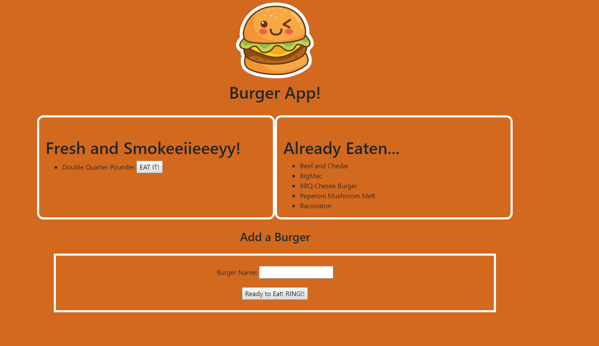

# BurgerApp

Did you order some burger or did your father cook some burger in BBQ? This app is for you!

You can add your burger. After you eat you can see what did you eat. 

It is so easy. Write your burger name. After eat Push "Eat It!" button. That's it!

Thank you for watching. 

-------------------------

Code written completly by SCB

This code written with ORM (Object-relational mapping) metod.

Code deployed on Heroku. DB initilize JawsDB. Mysql help us to create DB.

Used Express and Express Handlebars extentions. 

